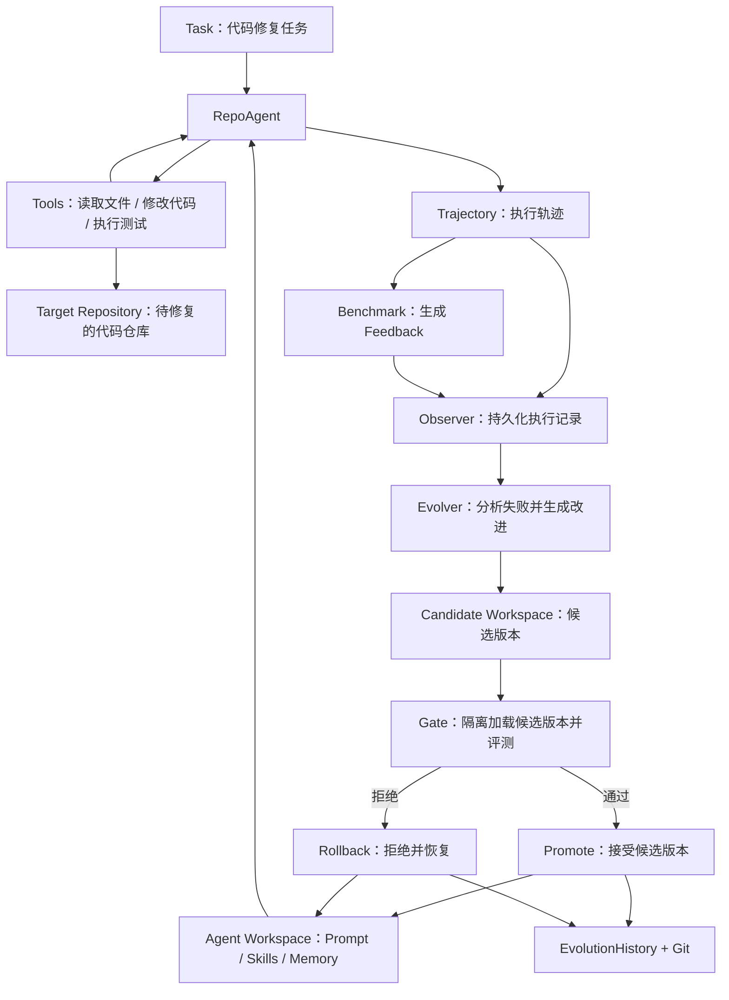

# A-Evolve 源码阅读笔记

## 1. 项目目标与核心架构

### 1.1 A-Evolve 解决什么问题？

A-Evolve 是一个用于研究和实现 Agent 自进化的框架。

它允许 Agent 在执行任务后，根据执行轨迹和评估结果，持续改进自己的 Prompt、Skill 和 Memory 等工作状态。

其核心思想是：**将负责执行任务的 Agent 与负责改进 Agent 的 Evolver 解耦，通过文件系统中的 Workspace 交换状态。**

### 1.2 核心组件

| 组件 | 主要职责 |
| --- | --- |
| Agent | 执行任务，调用工具，生成 Trajectory |
| Workspace | 保存 Prompt、Skill、Memory 等可进化状态 |
| Benchmark | 对任务执行结果进行独立评估，产生 Feedback |
| Observer | 将 Task、Trajectory、Feedback 持久化为 Observation 日志 |
| EvolutionEngine | 分析历史执行情况，修改 Workspace |
| EvolutionLoop | 协调任务执行、观察、进化、版本记录和重新加载 |
| VersionControl | 使用 Git 管理 Workspace 的版本、Diff 和回滚 |
| EvolutionHistory | 提供历史 Observation、评分曲线和版本查询接口 |

### 1.3 核心运行流程

1. `Agent.solve(task)` 执行任务，生成 Trajectory。
2. `Benchmark.evaluate()` 评价执行结果，生成 Feedback。
3. `Observer.collect()` 将 Observation 写入磁盘。
4. `EvolutionEngine.step()` 分析历史信息，并尝试改进 Workspace。
5. `VersionControl` 保存进化前后的 Git 快照。
6. `Agent.reload_from_fs()` 重新加载 Workspace，供下一轮任务使用。

**源码阅读发现：**

A-Evolve 的架构文档描述了 `Solve → Observe → Evolve → Gate → Reload`，但主循环并未强制每次进化都经过统一的 Gate。具体验证逻辑取决于使用的 Evolution Engine。

因此，设计自己的系统时，需要明确区分 Workspace 是否发生修改，以及修改是否经过验证并被接受。

### 1.4 对自己项目的启发

我的 Self-Evolving Repository Agent 可以借鉴以下设计：

- 将 Agent 的执行逻辑与 Evolver 的优化逻辑分离。
- 将 Prompt、Skill 和 Memory 保存在独立的 Workspace 中。
- 使用 Trajectory 和 Feedback 为进化提供证据。
- 使用 Git 保存候选版本、比较修改并支持回滚。
- 对进化结果进行独立验证，避免错误修改直接影响后续运行。

第一版项目只需要实现一条清晰、可靠的进化流程，暂时不需要支持多种可插拔进化算法。

## 2. 核心源码调用链

### 2.1 系统入口

文件：`agent_evolve/api.py`

`Evolver` 是框架对外提供的入口。它初始化 Agent、Benchmark、Evolution Engine，并将这些组件交给 `EvolutionLoop`。

调用关系：

```text
Evolver.run()
    ↓
EvolutionLoop.run()
```

### 2.2 单轮进化流程

文件：`agent_evolve/engine/loop.py`

`EvolutionLoop.run()` 负责组织每一轮进化：

```text
1. Benchmark.get_tasks("train")
              ↓
2. Agent.solve(task)
   生成 Trajectory
              ↓
3. Benchmark.evaluate(task, trajectory)
   生成 Feedback
              ↓
4. Observer.collect(observations)
   将执行记录持久化
              ↓
5. VersionControl.commit()
   保存进化前的 Workspace
              ↓
6. EvolutionEngine.step(...)
   分析历史记录、尝试修改 Workspace
              ↓
7. VersionControl.commit()
   保存进化后的 Workspace
              ↓
8. EvolutionHistory.record_cycle()
   记录本轮执行信息
              ↓
9. Agent.reload_from_fs()
   重新加载 Prompt、Skill、Memory
              ↓
10. 写入 history.jsonl 和 metrics.json
```

其中，某些 Evolution Engine 可以自行管理任务评测，因此具体执行路径可能有所区别。

### 2.3 Evolution Engine 的输入

文件：`agent_evolve/engine/base.py`

`EvolutionEngine.step()` 接收四个核心参数：

- `workspace`：可读取和修改的 Agent 状态。
- `observations`：当前轮次的任务执行记录。
- `history`：历史评估结果与 Git 版本的查询接口。
- `trial`：运行额外任务验证的能力。

这种设计使不同进化算法能够复用相同的基础设施。

### 2.4 Agent 如何执行任务

文件：`agent_evolve/agents/swe/agent.py`

`SweAgent.solve()` 主要完成：

1. 创建包含模型、系统提示词和工具的内部 Agent。
2. 组织当前任务及相关历史 Memory。
3. 启动模型与工具之间的交互循环。
4. 收集执行结果和工具调用轨迹，返回 Trajectory。

Skill 采用按需加载方式：Agent 首先看到 Skill 名称和描述，需要时通过 `read_skill()` 获取完整内容。

### 2.5 本节总结

A-Evolve 将整个系统划分为两个相互连接的循环：

**任务执行循环：**

`LLM 决策 → 工具调用 → 观察结果 → 再次决策`

**Agent 进化循环：**

`任务执行 → 结果评估 → 记录经验 → 修改 Workspace → 重新加载`

任务执行循环负责解决当前问题，进化循环负责改进后续任务的执行方式。

需要特别注意：在目前分析的默认主循环中，进化后的独立 Gate 验证并非强制步骤，而且本轮记录的 `cycle_score` 来源于进化前的任务批次，不能直接视为新版本的验证成绩。

## 3. 源码中的工程问题与改进方案

本节记录源码阅读中发现的潜在问题，并思考如何在 Self-Evolving Repository Agent 中改进。

### 3.1 Workspace 修改检测不完整

**相关源码：** `agent_evolve/algorithms/skillforge/engine.py`

默认 `AEvolveEngine.step()` 通过比较进化前后的 Skill 名称集合，判断 Workspace 是否发生修改。

潜在问题：

- 修改已有 Skill 的正文，名称不变，可能被判定为 `mutated=False`。
- 修改 System Prompt 或 Memory，也可能无法被检测。
- `mutated` 仅表示文件是否变化，无法证明修改已经通过验证。

**改进方案：**

使用 Git 检测 Workspace 的实际文件变化，包括新增、修改和删除。

明确区分三个状态：

- `mutated`：是否修改了 Workspace。
- `evaluated`：是否完成候选版本评测。
- `accepted`：是否通过 Gate 验证。

### 3.2 Gate 验证缺乏统一约束

**相关源码：** `agent_evolve/engine/loop.py`、`agent_evolve/algorithms/skillforge/engine.py`

框架提供了评测能力和 GatingStrategy，但默认主循环没有强制所有修改经过统一 Gate。

因此，不同 Evolution Engine 的验证行为可能存在差异。

**改进方案：**

我们的第一版项目采用统一的进化流程：

1. 创建候选修改。
2. 在独立环境中评测候选版本。
3. 将候选结果与基线版本进行比较。
4. 接受通过验证的修改。
5. 拒绝并回滚未通过验证的修改。

最终决策由统一的 Gate 负责，而不是由 Evolver 自己决定。

### 3.3 磁盘状态与 Agent 内存状态可能不同步

**相关源码：** `agent_evolve/protocol/base_agent.py`、`agent_evolve/engine/trial.py`

`BaseAgent.reload_from_fs()` 会将 Prompt、Skill 元数据和 Memory 加载到 Agent 的内存属性中。

但 `TrialRunner.run_tasks()` 直接调用 `agent.solve()`，没有主动执行重新加载。

因此，若 Evolution Engine 修改 Workspace 后立即进行评测，Agent 可能继续使用部分旧状态。

例如：

- 新增 Skill 可能没有进入缓存的 Skill 列表。
- 修改 System Prompt 后，内存中的旧 Prompt 可能仍然生效。
- 修改已有 Skill 正文时，某些实现又可能读取到新内容。

这可能造成候选版本评测时的新旧状态混用。

**改进方案：**

在验证候选版本前，显式加载该候选版本的 Workspace。

基线版本与候选版本使用相互隔离的评测环境，避免状态污染。

### 3.4 进化历史缺少完整的断点恢复机制

**相关源码：** `agent_evolve/engine/history.py`、`agent_evolve/engine/loop.py`

Observation 会持久化到 JSONL 文件中，但 `EvolutionHistory` 的周期记录主要保存在内存列表中。

虽然主循环另外写入了 `history.jsonl`，但初始化 `EvolutionHistory` 时没有完整恢复这些记录。

潜在问题：

- 程序崩溃后，内存中的历史状态丢失。
- Git Commit 已完成，但实验日志可能尚未写入。
- 重启时，Git 版本与实验记录可能不一致。

**改进方案：**

为每次进化定义唯一的实验标识，并维护明确的状态：

`PENDING → MUTATED → VALIDATED → COMMITTED`

对于未通过验证的候选版本，记录 `REJECTED` 及其原因。

每条实验记录至少包含：

| 字段 | 用途 |
| --- | --- |
| `run_id` | 标识一次实验运行 |
| `cycle` | 标识实验轮次 |
| `baseline_commit` | 进化前的 Git Commit |
| `candidate_commit` | 候选版本的 Git Commit |
| `baseline_score` | 基线表现 |
| `candidate_score` | 候选表现 |
| `status` | 当前执行状态 |
| `decision` | 接受或拒绝的结果 |

程序重启后，通过持久化记录和 Git 实际状态共同恢复执行进度。

### 3.5 设计结论

对于我的 Self-Evolving Repository Agent，优先保证以下性质：

1. **正确性**：只有通过验证的候选修改才能正式生效。
2. **可追溯性**：每次进化都有对应的执行轨迹、评测结果和 Git 版本。
3. **可恢复性**：程序中断后能够识别未完成的进化任务。
4. **状态一致性**：评测所使用的 Agent 状态必须与候选 Workspace 版本一致。
5. **简洁性**：第一版只实现一种进化算法，避免过早引入通用框架。

这些原则将指导后续 Evolution Engine、Gate、Workspace 和 History 模块的实现。

## 4. Self-Evolving Repository Agent 架构设计

### 4.1 第一版架构图



### 4.2 对应的 Python 模块

| 模块 | 计划实现的职责 |
| --- | --- |
| `agent/` | RepoAgent、LLM 接口和 Agent Loop |
| `tools/` | 读取代码、修改文件、执行命令 |
| `memory/` | Skill 与历史经验的加载、保存 |
| `benchmark/` | 任务集、评测器和 Feedback |
| `evolution/` | Evolver、Gate、版本控制、实验记录 |
| `workspace/` | 保存 Agent 可进化的 Prompt、Skill、Memory |

### 4.3 三个核心设计原则

**原则一：分离执行与进化。**

RepoAgent 负责完成代码任务，Evolver 负责分析执行结果并提出改进。

**原则二：区分两个 Workspace。**

- Agent Workspace：保存 Agent 自己的 Prompt、Skills、Memory，是自进化的对象。
- Target Repository：需要 Agent 修复或修改的代码仓库，是任务执行的对象。

二者应当隔离，避免任务代码修改影响 Agent 自身的状态。

**原则三：候选版本必须经过独立验证。**

Evolver 生成候选版本后，Gate 在隔离环境中加载并评测该版本，再决定接受还是回滚。

每次进化都应保留执行轨迹、评测结果和 Git 版本信息，以支持复现和失败分析。

### 4.4 第一版实现范围

第一版先实现一个 RepoAgent、一种进化策略和一个统一的 Gate。

优先完成可运行、可验证、可回滚的端到端闭环，再逐步增加复杂功能。
